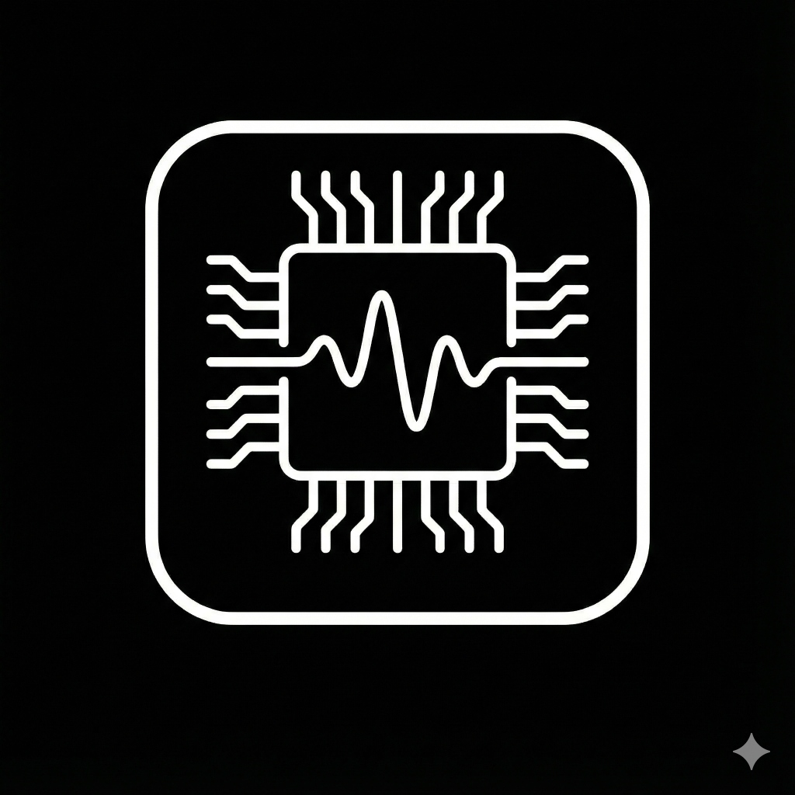

# Frictionless

**The system monitor for minimalists.**

Designed exclusively for macOS, Frictionless replaces cluttered, noisy dashboards with a precision-engineered, "OLED Black" interface that disappears into your workflow until you need it.

## Features

- **True OLED Black**: The first system monitor designed to look stunning on modern displays. No greys, just absolute black.
- **Zero-Click Info**: See your CPU, RAM, Disk, and Network stats instantly in your Menu Bar.
- **Frictionless Detail**: Click any stat for a beautiful, distraction-free popover with historical graphs and deep insights.
- **Detachable Windows**: Pin specific monitors (like CPU or Network) to your desktop for permanent visibility.
- **Unified Icon Mode**: Save menu bar space by consolidating all stats into one icon that rotates intelligently.
- **Privacy First**: No tracking, no analytics, no cloud. Your system data stays on your system.

## Installation

### Download

Download the latest release from the [Releases](https://github.com/mstrslv13/frictionless/releases) page or install via the App Store.

### Manual Installation

1. Download `Frictionless-Installer.dmg`
2. Open the DMG
3. Drag `Frictionless.app` to your Applications folder
4. Launch from Applications or Spotlight

## Usage

### Getting Started

1. **Launch** the app from your Applications folder
2. Grant any necessary permissions when prompted
3. Frictionless will appear in your **Menu Bar** (default: Unified Icon mode)

### View Modes

**Unified Icon Mode** (Default)
- Single rotating icon in the menu bar
- Click to see all stats in one compact popover
- Configurable rotation interval (1-30 seconds)

**Separate Icons Mode**
- Individual icons for CPU, RAM, Disk, and Network
- Click any icon to see detailed stats for that resource
- Enable/disable individual monitors in Settings

### Settings

Access settings by clicking the gear icon (⚙️) in any popover:

- **View Mode**: Toggle between Unified and Separate Icons
- **Update Interval**: Adjust rotation speed (Unified mode)
- **Resource Visibility**: Enable/disable specific monitors
- **Display Format**: Choose between Percent, Used, or Free for RAM/Disk
- **Theme**: Always OLED Black (as it should be)
- **Launch at Login**: Auto-start on system boot (enabled by default)

### Keyboard Shortcuts

- **Quit**: `Cmd + Q` (when popover is open)

## System Requirements

- macOS 13.0 (Ventura) or later
- Apple Silicon or Intel Mac

## Privacy & Permissions

Frictionless only accesses:
- System resource usage (CPU, RAM, Disk, Network)
- Running process information (for Process Manager)

**No data leaves your Mac. Ever.**

## Credits

Designed and developed by **William Azada** ([mstrslv13](https://github.com/mstrslv13))

Built for those who value aesthetics as much as performance.

## License

Copyright © 2025 William Azada. All rights reserved.

## Support

For issues, feature requests, or questions:
- Open an issue on [GitHub](https://github.com/mstrslv13/frictionless/issues)
- Contact: [Your support email/link]

---

*Frictionless: Because your system monitor shouldn't be louder than your system.*
